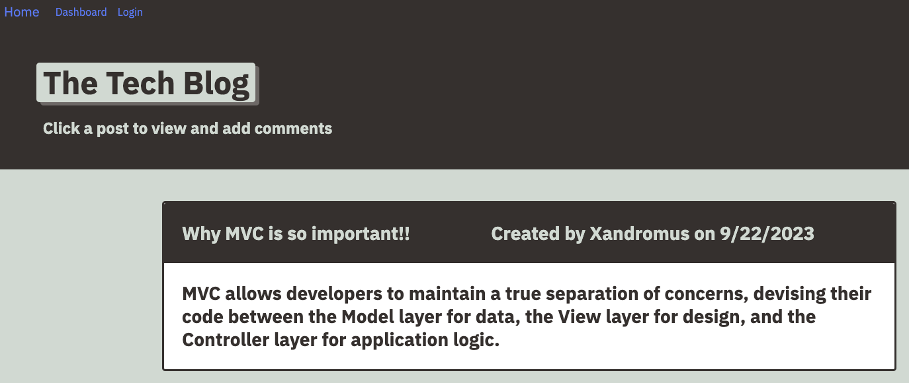

# Tech Blog

## Description

Blog where developers can publish their posts and comment on other developers’ posts
Uses Handlebars.js as the templating language, Sequelize as the ORM, and the express-session npm package for authentication. Data is stored/retrieved from a MySQL database.

## Table of Contents

- [Installation](#installation)
- [Usage](#usage)
- [Tests](#tests)
- [Questions](#questions)

## Installation

Create a local .env file, filling in the appropriate database username and password:  
```
DB_NAME='blog_db'  
DB_USER=''  
DB_PASSWORD=''
```

To install dependencies:
```npm i```

Open a SQL connection and run database schema:
```source db/schema.sql```

Seed data to database:
```npm run seed```

## Usage

To run application:
```npm start```

Example of homepage for tech blog:



Deplyed Application:  
[Heroku](https://github.com/matthkang)

Use test username and password:
```
username: Xandromus
password: password12345
```

---

## Tests

No tests

## Questions

Take a look at my other projects: [GitHub Profile](tech-blog-mk-be274da16b7b.herokuapp.com)

You can reach me via email at: [matthkang@gmail.com](mailto:matthkang@gmail.com)